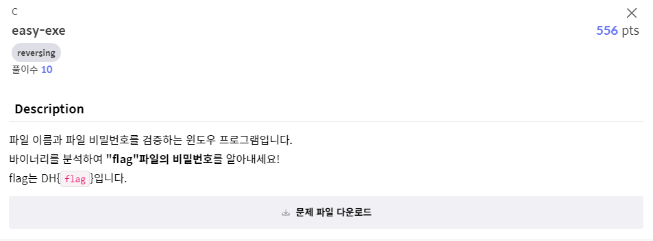
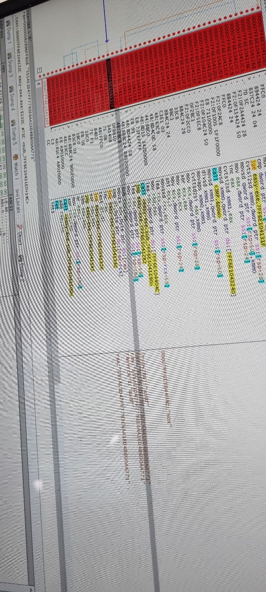
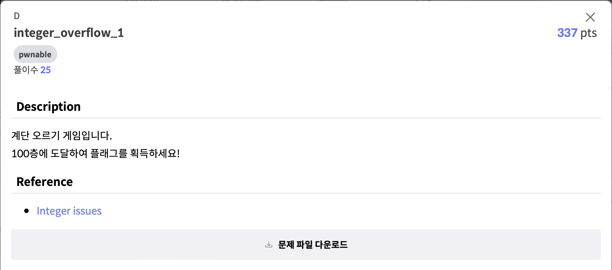

# 2021 사이버 가디언즈 CTF 예선전
해결한 문제들의 풀이과정 설명을 위한 Repo입니다.


## A. security-quiz


## C. easy-exe

문제를 풀기 위해서 처음에 exe 파일을 notepad++ 프로그램으로 열려고 했으나,\
리버싱이라는 기법을 구글에 검색해보고 전혀 이 방법으로 접근해서는 정답을 알 수 없다는 것을 알게 되었습니다.\
리버싱이 가능한 프로그램이 존재했으며, 다양한 프로그램을 시도해보았습니다.\
ollydbg, ida, x64dbg를 사용해보았는데, 본 문제를 풀기위하여 x64dbg를 사용하였습니다.\

처음엔 먼저 뜨는 어셈블리어와 프로그램 사용법을 익히게 되었고, breakpoint의 사용법과 call을 이용하여 함수를 호출한다는 것을 알게되었습니다.\
디버깅을 시작하고 가능한한 모든 함수과정에 breakpoint를 찍어 함수의 작동과정을 공부하게 되었고, 가능한한 최대한 많이 메모리에 있는 문자열을 읽었습니다.\
그 결과 아래에 있던 것처럼 플래그 값을 찾을 수 있었고 문제 해결에 성공할 수 있었습니다.\



## D. integer_overflow_1

선택지를 통해 계단을 오르내리는 문제입니다.\
처음에 최대 계단 수가 99까지라 끝까지 올라가면 해결될까 싶어 climb를 계속 선택해 끝층에 도달했습니다.\
하지만 힘들어 더이상 못올라간다는 문구와 함께 더이상 오르지 않았습니다.

이후 문제의 제목처럼 OverFlow 현상이 생각나 0층에서 더 내려가기를 선택했습니다.\
예상대로 층 카운트 변수는 unsigned int형이었고 0보다 작아지자 overflow가 일어나며 4만이 넘도록 치솟았습니다.

```c
if(floor_index > 100){
    system("cat flag.txt");
}
```
층수가 100이 넘어가게 되어 `cat flag.txt` 명령이 실행되었고 문제를 해결했습니다.


## G. dreamcafe
