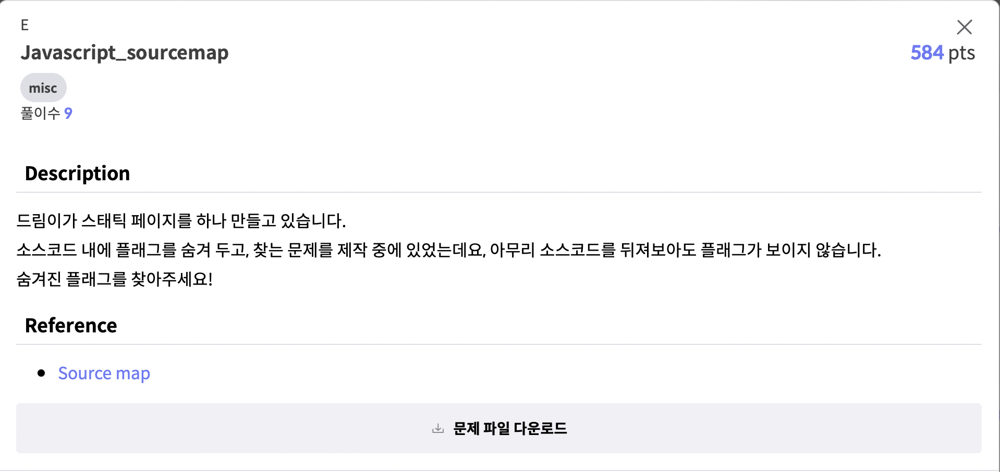

# 2021 사이버 가디언즈 CTF 본선
본선에서 해결한 문제들의 풀이과정 설명을 위한 Repo입니다.

## E. Javascript_sourcemap

제목 그대로 JavaScript Sourcemap을 이용한 문제입니다.\
웹페이지 소스코드에서 js 파일 주소를 찾아 Sourcemap으로 연결된 파일의 경로를 알아내었습니다.

이후 해당 경로로 접속해 library.js.map 파일을 다운로드 받을 수 있었고\
안쪽에 flag를 출력해주는 함수가 작성되어 있었습니다.\
이 함수를 개발자 옵션의 콘솔에서 실행시켜 flag를 얻었습니다.